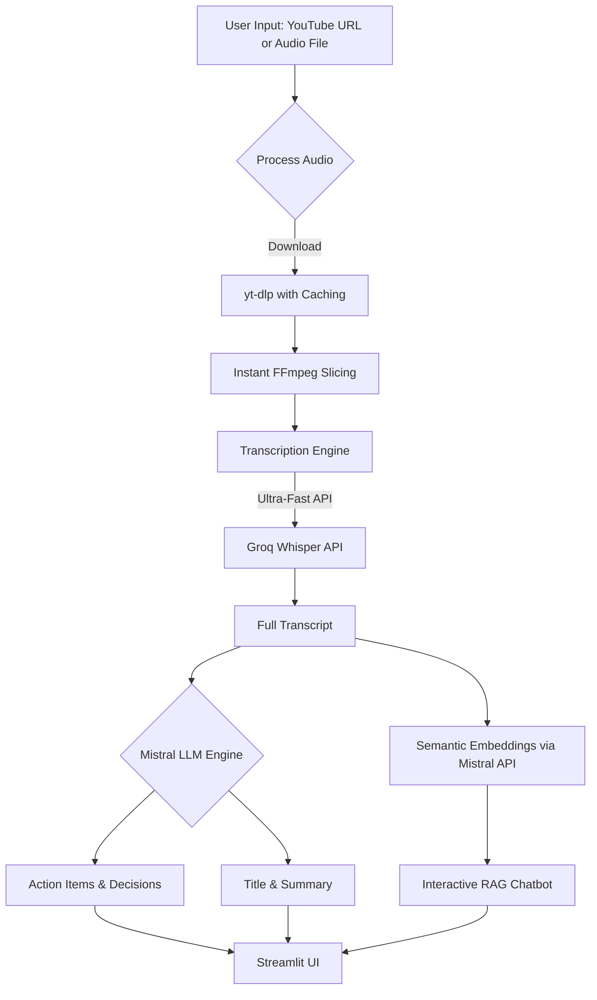

# AI Video Summariser

AI Video Summariser is an intelligent meeting and video analyst, designed to be **lightweight, lightning-fast, and 100% cloud-ready**. It allows you to upload any video/audio file or paste a YouTube URL to automatically:

1. **Transcribe** the audio using **Groq's Whisper API** for ultra-fast, near-instant transcription.
2. **Summarize** the transcript and extract insights using the **Mistral LLM API**.
3. **Chat** with the video content using a RAG-powered chatbot backed by **Mistral Semantic Embeddings**.

## Architecture Pipeline



## Features
- **Cloud-Ready:** Zero heavy local ML dependencies. Safe to deploy to Heroku, Vercel, or Streamlit Community Cloud without memory crashes.
- **Ultra-Fast Transcription:** Powered by Groq's LPU hardware, capable of transcribing a 10-minute chunk in under 3 seconds.
- **Mistral LLM Integration:** Fast, accurate summarization and intelligent Q&A using `mistral-small-latest`.
- **Proper Semantic RAG:** Ask specific questions about the video. The chatbot finds relevant answers by meaning, not just exact keywords, using Mistral Vector Embeddings.
- **Smart Caching & Disk Management:** Automatically skips downloading/chunking previously processed videos, and limits the disk cache to 2GB to prevent hard drive bloat.

## Setup Instructions

1. **Clone the repository**
2. **Install dependencies:**
   ```bash
   pip install -r requirements.txt
   ```
3. **Set up FFmpeg:**
   Make sure you have `ffmpeg` installed on your system (e.g. `brew install ffmpeg` on macOS or `sudo apt install ffmpeg` on Linux).
4. **Environment Variables:**
   Create a `.env` file and add your API keys:
   ```env
   MISTRAL_API_KEY="your_mistral_api_key_here"
   MISTRAL_MODEL="mistral-small-latest"
   GROQ_API_KEY="your_groq_api_key_here"
   ```
5. **Run the App:**
   ```bash
   streamlit run streamlit_app.py
   ```

## Stack
- **UI:** Streamlit
- **Transcription:** Groq Whisper API
- **LLM / Chat / Embeddings:** Mistral API
- **Audio Processing:** yt-dlp & FFmpeg
